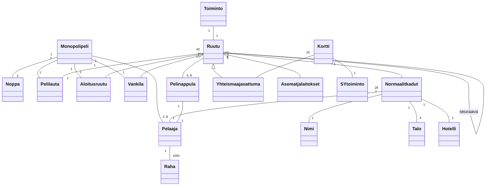

## Monopoli, luokkakaavio

```mermaid
 classDiagram
    Monopolipeli "1" -- "2" Noppa
    Monopolipeli "1" -- "2..8" Pelaaja
    Monopolipeli "1" -- "1" Pelilauta
    Monopolipeli "1" -- "1" Aloitusruutu
    Monopolipeli "1" -- "1" Vankila
    Ruutu "40" -- "1" Pelilauta
    Ruutu "1" -- "0..8" Pelinappula
    Ruutu "1" -- "1" Ruutu : seuraava
    Ruutu <|-- Normaalit kadut
    Ruutu <|-- Aloitusruutu
    Ruutu <|-- Vankila
    Ruutu <|-- Yhteismaa ja sattuma
    Ruutu <|-- Asemat ja laitokset
    Toiminto "1" -- "1" Ruutu
    Normaalit kadut "1" -- "1" Nimi
    Normaalit kadut "1" -- "4" Talo
    Normaalit kadut "1" -- "1" Hotelli
    Normaalit kadut "28" -- "1" Pelaaja
    Kortti "20" -- "4" Yhteismaa ja sattuma
    Kortti "1" -- "1" SY toiminto
    Pelinappula "1" -- "1" Pelaaja
    Pelaaja "1" -- "1000" Raha
```
