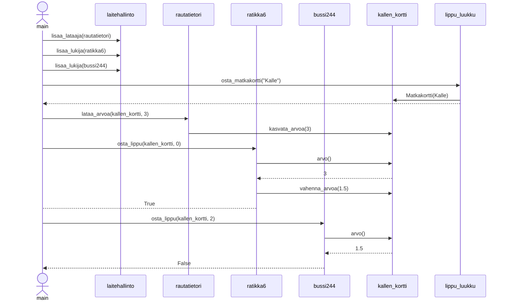

```mermaid
 sequenceDiagram
    actor main
    participant laitehallinto
    participant rautatietori
    participant ratikka6
    participant bussi244
    participant kallen_kortti
    participant lippu_luukku
    
    main->>laitehallinto: lisaa_lataaja(rautatietori)
    main->>laitehallinto: lisaa_lukija(ratikka6)
    main->>laitehallinto: lisaa_lukija(bussi244)
    main->>lippu_luukku: osta_matkakortti("Kalle")
    lippu_luukku->> kallen_kortti: Matkakortti(Kalle)
    lippu_luukku-->> main:
    main->>rautatietori: lataa_arvoa(kallen_kortti, 3)
    rautatietori->>kallen_kortti: kasvata_arvoa(3)
    main->>ratikka6: osta_lippu(kallen_kortti, 0)
    ratikka6->>kallen_kortti: arvo()
    kallen_kortti-->>ratikka6: 3
    ratikka6->>kallen_kortti: vahenna_arvoa(1.5)
    ratikka6-->main: True
    main->>bussi244: osta_lippu(kallen_kortti, 2)
    bussi244->>kallen_kortti: arvo()
    kallen_kortti-->>bussi244: 1.5
    bussi244-->>main: False
```