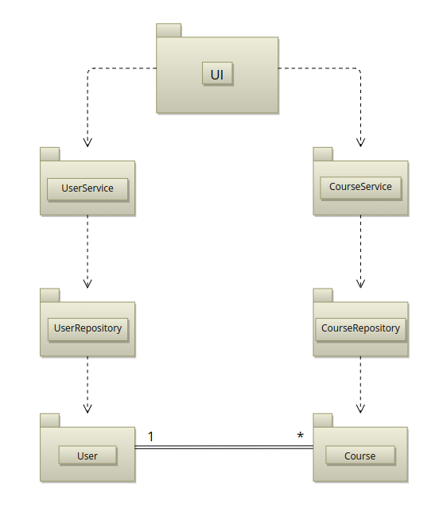
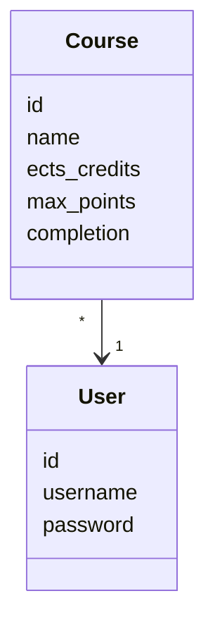
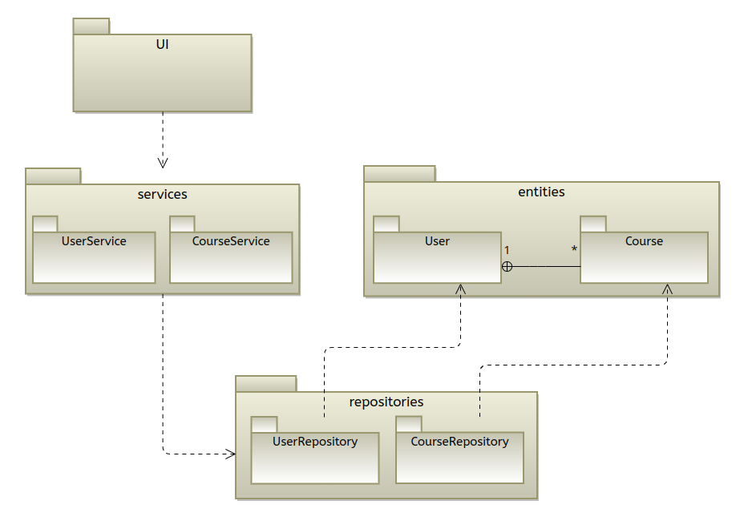
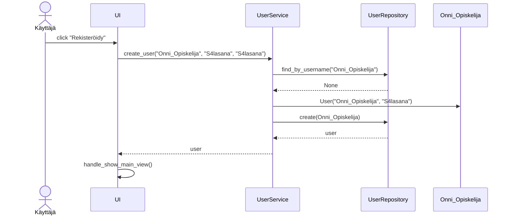
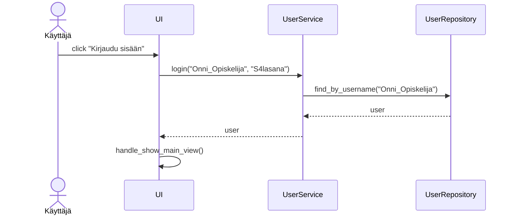
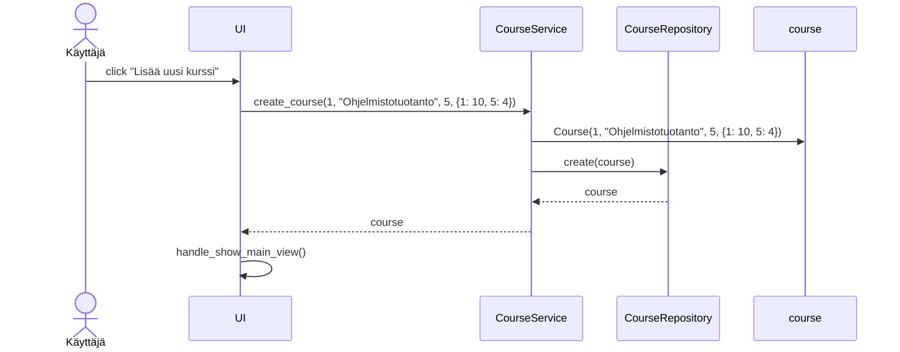
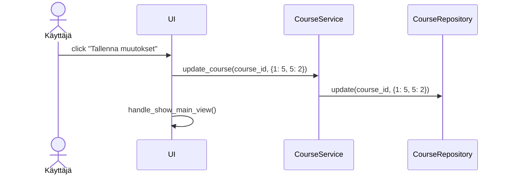

# Arkkitehtuurikuvaus

## Rakenne

Ohjelman rakenne noudattaa kolmitasoista kerrosarkkitehtuuria allaolevan kuvan mukaisesti.

 

## Käyttöliittymä

Käyttöliittymässä on kuusi eri näkymää:
- Sisäänkirjautuminen
- Uuden käyttäjän luominen
- Etusivu
  - Meneillään olevien kurssien listaus.
  - Ohjaus kurssisivuille, uuden kurssin lisäämiseen, suoritettuihin kursseihin ja uloskirjautumiseen.
- Uuden kurssin lisäys
- Kurssisivu
  - Mahdollisuus päivittää meneillään olevan kurssin tehtävien pistekertymää.
  - Mahdollisuus merkitä kurssi suoritetuksi.
- Suoritetut kurssit
  - Lista suoritetuista kursseista, ja ohjaus jokaisen omalle kurssisivulle.

Näkymien näyttämisestä vastaa [UI](https://github.com/tihvis/ot-harjoitustyo/blob/master/study-app/src/ui/ui.py)-luokka. Jokainen näkymä on toteutettu omana luokkanaan. Käyttöliittymä on eristetty sovelluslogiikasta kutsumalla sovelluslogiikasta vastaavien [UserService](https://github.com/tihvis/ot-harjoitustyo/blob/master/study-app/src/services/user_service.py)- ja [CourseService](https://github.com/tihvis/ot-harjoitustyo/blob/master/study-app/src/services/course_service.py)-luokkien metodeja.

## Sovelluslogiikka

Sovelluksen loogisen tietomallin muodostaa käyttäjiä ja heidän kursseja kuvaavat luokat [User](https://github.com/tihvis/ot-harjoitustyo/blob/master/study-app/src/entities/user.py) ja [Course](https://github.com/tihvis/ot-harjoitustyo/blob/master/study-app/src/entities/course.py).

Luokat [UserService](https://github.com/tihvis/ot-harjoitustyo/blob/master/study-app/src/services/user_service.py) ja [CourseService](https://github.com/tihvis/ot-harjoitustyo/blob/master/study-app/src/services/course_service.py) vastaavat sovelluslogiikasta, ja tarjoavat toiminnalliset kokonaisuudet kaikille käyttöliittymän toiminnoille. 

Esimerkkejä UserService-luokan metodeista:
- `login(username, password)`
- `logout()`
- `create_user(username, password, password2)`

Esimerkkejä CourseService-luokan metodeista:
- `create_course(user_id, name, etcs_credits, max_points)`
- `update_course(course_id, completed_points)`
- `set_done(course_id, grade, completion_date)`
- `delete_course(course_id)`
- `get_completed_courses_by_user_id(user_id)`

`UserService` ja `CourseService` pääsevät käsiksi käyttäjiin ja kurssitietojen tallentamiseen kutsumalla luokkia [UserRepository](https://github.com/tihvis/ot-harjoitustyo/blob/master/study-app/src/repositories/user_repository.py) ja [CourseRepository](https://github.com/tihvis/ot-harjoitustyo/blob/master/study-app/src/repositories/course_repository.py), jotka vastaavat tiedon pysyväistallennuksesta SQLite-tietokantaan. Näiden luokkien toteutukset injektoidaan sovelluslogiikan luokille konstruktorikutsun yhteydessä.

Sovelluksen eri kerrokset ja luokat ovat suhteessa toisiinsa allaolevan pakkauskaavion mukaisesti.

 

## Toimintalogiikka

Alla on kuvattu sovelluksen päätoiminnallisuuksien toimintalogiikkaa sekvenssikaavioina.

### Uuden käyttäjän luominen

Kun sovelluksen alkunäkymästä klikataan "Luo uusi käyttäjätunnus", käyttäjää pyydetään syöttämään käyttäjätunnus sekä salasana kahdesti. Jos syötetty käyttäjätunnus ei ole käytössä, ja syötetyt salasanat täsmäävät ja täyttävät annetut vaatimukset, etenee sovelluksen kontrolli seuraavasti:

### Sisäänkirjautuminen

Kun sovelluksen kirjautumisnäkymässä syötetään olemassaoleva käyttäjätunnus ja siihen liittyvä oikea salasana, etenee sovelluksen kontrolli seuraavasti:

### Uuden kurssin lisääminen

Kun sisäänkirjautunut käyttäjä klikkaa "Lisää uusi kurssi"-painiketta sovelluksen päänäkymästä, ja syöttää kurssin tiedot (nimi, opintopisteet, ja mahdolliset tehtävät ja niiden pistemäärät) etenee sovelluksen kontrolli seuraavasti:

### Meneillään olevan kurssin etenemisen päivittäminen

Kun sisäänkirjautunut käyttäjä on lisännyt uuden kurssin itselleen, hän pääsee päivittämään sen etenemistä klikkaamalla kyseisen kurssin kohdalla olevaa "Näytä/muokkaa" painiketta sovelluksen etusivulla. Kun käyttäjä on syöttänyt päivitetyt pistekertymät kurssin eri tehtäville, sovelluksen kontrolli etenee seuraavasti:

