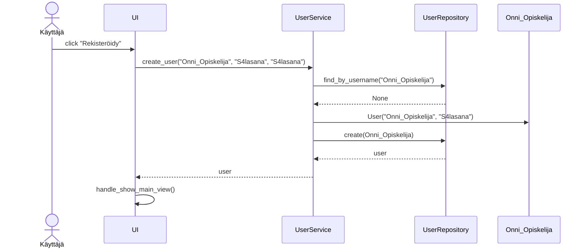
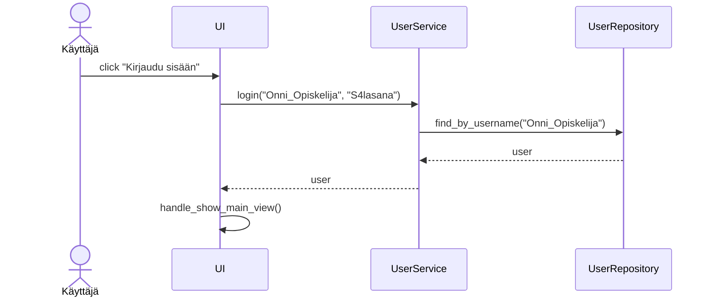
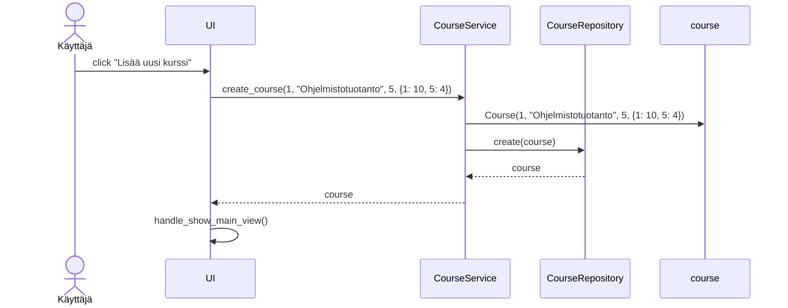
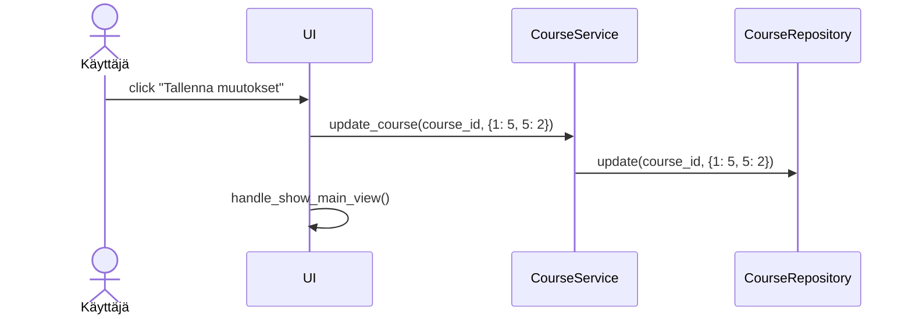

# Arkkitehtuurikuvaus

## Rakenne

Ohjelman rakenne noudattaa kolmitasoista kerrosarkkitehtuuria allaolevan kuvan mukaisesti.

Luokat [UserService](https://github.com/tihvis/ot-harjoitustyo/blob/master/study-app/src/services/user_service.py) ja [CourseService](https://github.com/tihvis/ot-harjoitustyo/blob/master/study-app/src/services/course_service.py) vastaavat sovelluksen sovelluslogiikasta, ja tarjoavat toiminnalliset kokonaisuudet kaikille käyttöliittymän (UI) toiminnoille. 

UserService ja CourseService pääsevät käsiksi käyttäjiin ja kurssitietojen tallentamiseen kutsumalla luokkia [UserRepository](https://github.com/tihvis/ot-harjoitustyo/blob/master/study-app/src/repositories/user_repository.py) ja [CourseRepository](https://github.com/tihvis/ot-harjoitustyo/blob/master/study-app/src/repositories/course_repository.py), jotka vastaavat tiedon pysyväistallennuksesta SQLite-tietokantaan.

Sovelluksen loogisen tietomallin muodostaa käyttäjiä ja heidän kursseja kuvaavat luokat [User](https://github.com/tihvis/ot-harjoitustyo/blob/master/study-app/src/entities/user.py) ja [Course](https://github.com/tihvis/ot-harjoitustyo/blob/master/study-app/src/entities/course.py).

## Toimintalogiikka

Alla on kuvattu sovelluksen päätoiminnallisuuksien toimintalogiikkaa sekvenssikaavioina.

### Uuden käyttäjän luominen

Kun sovelluksen alkunäkymästä klikataan "Luo uusi käyttäjätunnus", käyttäjää pyydetään syöttämään käyttäjätunnus sekä salasana kahdesti. Jos syötetty käyttäjätunnus ei ole käytössä, ja syötetyt salasanat täsmäävät ja täyttävät annetut vaatimukset, etenee sovelluksen kontrolli seuraavasti:

### Sisäänkirjautuminen

Kun sovelluksen kirjautumisnäkymässä syötetään olemassaoleva käyttäjätunnus ja siihen liittyvä oikea salasana, etenee sovelluksen kontrolli seuraavasti:

### Uuden kurssin lisääminen

Kun sisäänkirjautunut käyttäjä klikkaa "Lisää uusi kurssi"-painiketta sovelluksen päänäkymästä, ja syöttää kurssin tiedot (nimi, opintopisteet, ja mahdolliset tehtävät ja niiden pistemäärät) etenee sovelluksen kontrolli seuraavasti:

### Meneillään olevan kurssin etenemisen päivittäminen

Kun sisäänkirjautunut käyttäjä on lisännyt uuden kurssin itselleen, hän pääsee päivittämään sen etenemistä klikkaamalla kyseisen kurssin kohdalla olevaa "Näytä/muokkaa" painiketta sovelluksen etusivulla. Kun käyttäjä on syöttänyt päivitetyt pistekertymät kurssin eri tehtäville, sovelluksen kontrolli etenee seuraavasti:

