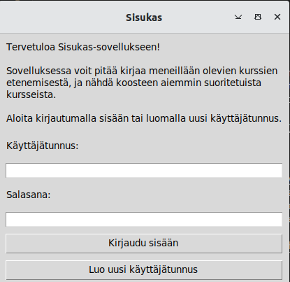
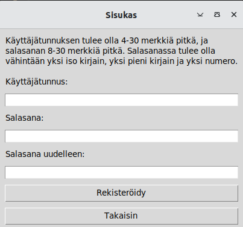
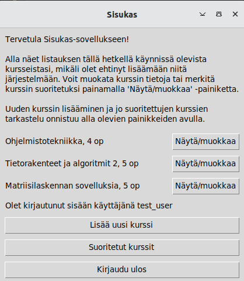
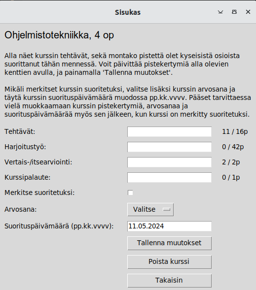

# Käyttöohje

Lataa projektin tuoreimman [releasen](https://github.com/tihvis/ot-harjoitustyo/releases) lähdekoodi _Assets_-osion alta. 

## Konfigurointi

Siirry projektin juurihakemistoon _study-app_:

```
cd study-app
```

 Luo juurihakemistoon _.env_-tiedosto ja määritä sen sisältö seuraavanlaiseksi:

```
STUDYAPP_FILENAME=studyapp.sqlite
```

## Ohjelman käynnistäminen

Ennen ohjelman käynnistämistä, lataa sen riippuvuudet komennolla:

```
poetry install
```

Suorita sitten projektin alustustoimenpiteet komennolla:

```
poetry run invoke build
```

Jonka jälkeen voit käynnistää ohjelman komennolla:

```
poetry run invoke start
```

## Sisäänkirjautuminen

Sovellus käynnistyy kirjautumisnäkymään, mistä voi joko kirjautua sisään syöttämällä olemassaolevan käyttäjätunnuksen ja salasanan ja painamalla "Kirjaudu sisään"-painiketta, tai siirtyä luomaan uutta käyttäjätunnusta. 



## Uuden käyttäjän luominen

Uuden käyttäjätunnuksen voi luoda syöttämällä haluttu käyttäjätunnus, sekä salasana toistamiseen. Mikäli annettu käyttäjätunnus ja salasana täyttää vaaditut kriteerit, "Rekisteröidy"-painiketta painamalla käyttäjä luodaan ja kirjataan sisään, ja sovellus ohjautuu etusivulle.



## Etusivu

Sisäänkirjautumisen jälkeen sovellus ohjautuu etusivulle, josta näkyy käyttäjän käynnissä olevat kurssit opintopisteineen. Käyttäjän on mahdollista avata jokaisen kurssin oma kurssisivu auki "Näytä/muokkaa"-painikkeesta, tai lisätä uusi kurssi "Lisää uusi kurssi"-painikkeesta. Uloskirjautuminen onnistuu "Kirjaudu ulos"-painikkeesta, jolloin sovellus ohjautuu takaisin kirjautumisnäkymään.



## Uuden kurssin lisääminen

Uuden kurssin lisääminen onnistuu syöttämällä kurssin nimi, opintopistemäärä sekä kurssin eri tehtävien yhteenlasketut kokonaispistemäärät ja painamalla "Tallenna"-painiketta. Jos syötetyt arvot olivat oikeassa muodossa, kurssi tallentuu tietokantaan ja sovellus ohjautuu takaisin etusivulle.


## Kurssitiedot ja etenemisen päivittäminen

Kurssin etenemisen päivittäminen ja kurssitietojen tarkastelu onnistuu painamalla etusivun "Näytä/muokkaa"-painiketta halutun kurssin kohdalta. 

Kurssisivulla käyttäjän on mahdollista nähdä montako pistettä hän on tähän asti suorittanut eri tehtäväosioista, ja päivittää niiden pistemääriä. Kurssin voi merkitä suoritetuksi ruksaamalla "Merkitse suoritetuksi"-laatikko, sekä täydentämällä kurssin arvosana ja suorituspäivämäärä ennen tallentamista "Tallenna muutokset"-painikkeesta.

Kurssin voi myös poistaa painamalla "Poista kurssi"-painiketta, jolloin sovellus vielä varmistaa pyynnön käyttäjältä ennen kurssin poistamista.



## Suoritetut kurssit

Kun kurssi on merkitty suoritetuksi, se tulee näkyviin suoritettujen kurssien näkymään, johon pääsee etusivulta "Suoritetut kurssit"-painikkeesta. Sivulla näkyy listattuna käyttäjän suoritetut kurssit, sekä hyväksytysti suoritettujen kurssien opintopisteet, sekä niiden pohjalta laskettu painotettu keskiarvo.

Käyttäjä voi halutessaanvielä tarkastella tai muokata kurssin tietoja painamalla "Näytä/muokkaa"-painiketta, jolloin sovellus ohjautuu kyseisen kurssin kurssisivulle.

