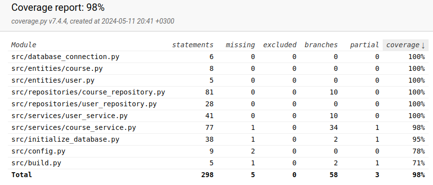

# Testausdokumentti

Sovellusta on testattu automatisoiduilla yksikkö- ja integraatiotesteillä, sekä manuaalisilla järjestelmätesteillä.

## Yksikkö- ja integraatiotestaus

### Sovelluslogiikka

Sovelluslogiikasta vastaavia `CourseService`- ja `UserService`-luokkia testataan [TestCourseService](https://github.com/tihvis/ot-harjoitustyo/blob/master/study-app/src/tests/services/course_service_test.py)- ja [TestUserService](https://github.com/tihvis/ot-harjoitustyo/blob/master/study-app/src/tests/services/user_service_test.py)-testiluokilla. Testiluokat hyödyntävät _.env.test_ -tiedostossa olevaa testitietokantaa.

### Repositorio-luokat

Tiedon pysyväistallennuksesta vastaavia `CourseRepository` ja `UserRepository`-luokkia testataan [TestCourseRepository](https://github.com/tihvis/ot-harjoitustyo/blob/master/study-app/src/tests/repositories/course_repository_test.py) ja [TestUserRepository](https://github.com/tihvis/ot-harjoitustyo/blob/master/study-app/src/tests/repositories/user_repository_test.py)-testiluokilla. Samoin kuin sovelluslogiikan testeissä, myös repositorio-luokkien testeissä hyödynnetään _.env.test_ -tiedostossa olevaa testitietokantaa.

### Testauskattavuus

Sovelluksen testauksen haaraumakattavuus käyttöliittymäkerrosta lukuunottamatta on 98%.

## Järjestelmätestaus

### Asennus ja konfigurointi

Sovelluksen asennusta ja konfiguraatiota on testattu manuaalisesti [käyttöohjeen](./kayttoohje.md) mukaisesti. Sovellusta on testattu tilanteissa, joissa tietokanta on ollut jo olemassa, sekä tilanteissa joissa sitä ei ole ollut, jolloin tietokanta on luotu ja alustettu käyttöohjeiden mukaisesti.

### Toiminnallisuus

Kaikki [vaatimusmäärittelyn](https://github.com/tihvis/ot-harjoitustyo/blob/master/study-app/dokumentaatio/vaatimusmaarittely.md#perusversion-tarjoama-toiminnallisuus) toiminnallisuudet on testattu manuaalisesti sekä valideilla, että virheellisillä syötteillä.